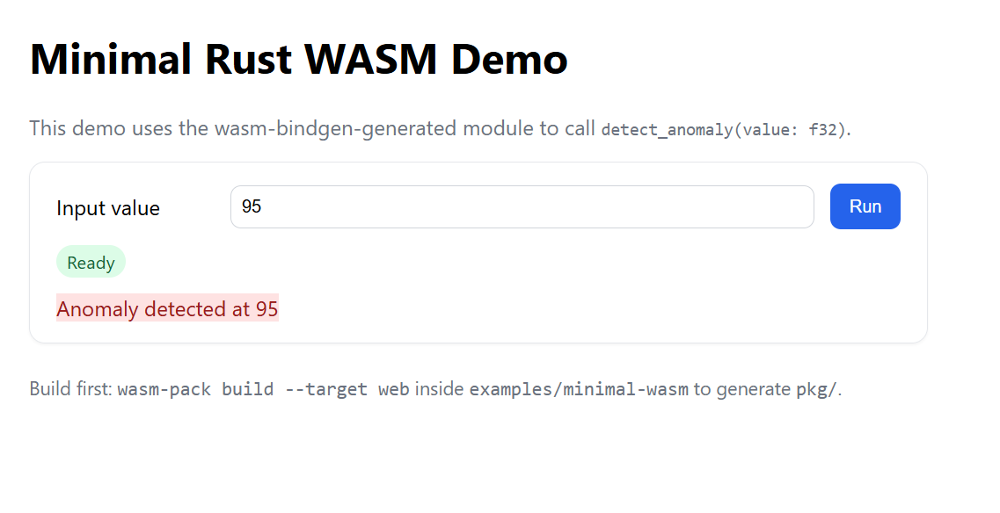

# Examples



This directory contains example projects for MedWASMAI.

- `minimal-wasm/`: A minimal Rust + wasm-bindgen project you can build with `wasm-pack`.

## Build minimal-wasm

```bash
cd examples/minimal-wasm
wasm-pack build --target web
```

The build output will be in `pkg/`.

## Run minimal-wasm in the browser

You need to serve the folder over HTTP (not file://) due to module loading and CORS.

Option A: Python (built-in)

```bash
cd examples/minimal-wasm
python3 -m http.server 8080
```

Then open:

```
http://localhost:8080/
```

Option B: Node.js (serve)

```bash
npm -g install serve
cd examples/minimal-wasm
serve -l 8080
```

Open `index.html` and press "Run" after the status shows "Ready". Adjust the input value to test `detect_anomaly(value: f32)`.
